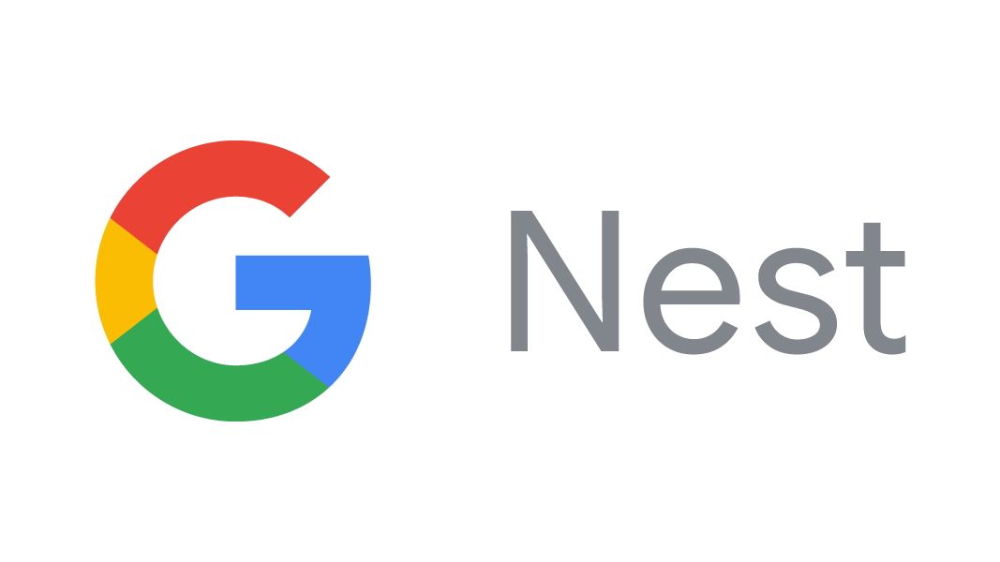
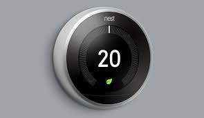

# NestDeviceAccess Binding

This binding integrates Nest products through the [Google Smart Device Management (SDM) API](https://developers.google.com/home/smart-device-management).

_If possible, provide some resources like pictures, a YouTube video, etc. to give an impression of what can be done with this binding. You can place such resources into a `doc` folder next to this README.md._

## Supported Things

The NestDeviceAccess Binding will support things allowd by the Google Smart Device Management (SDM) API. Currently
the binding implements the Thermostat and device traits for Nest products defined at the [SDM traits](https://developers.google.com/nest/device-access/traits).

Thermostat Trait - Currently supported (Tested against generation 2 and 3 Nest Thermostats)

Doorbell Trait - (Needs to be implemented)
Camera Trait - (Needs to be implemented)

## Discovery

The NestDeviceAccess binding works through discovery by leveraging the Google SDM API to perform a devices trait call to get all devices allowed by the accessToken. The devices are then enumerated to identify the "Type" of device. If it is a Thermostat "Type" then the device will be added to the inbox.

Once added to the inbox, the device can be added as a thing. The thing will import several default properties to allow communication with the SDM API. 

Note: You MUST configure the discovery service through the services/cfg folder.. The format is listed under the BINDING CONFIGURATION section of this document. The file must be named nestdeviceaccess.cfg
## Binding Configuration

'# Configuration for the Nest Device Access Binding
#
'# There is general project information for Google that must be provided in order to discover Nest products
'# The configuration data is a per project configuration and can be changed by the user.
'# A sandbox project created by Brian Higginbotham @BHigg was created and listed below for testing purposes only
'# Use the project at your own risk for testing or create your own project through Google and enable the SDM APIs for individual use
'# Note this project is limited in nature as a sandbox project to 30 API calls/min by Google.
'#
'#
'#projectId is the Google project provided through the project creation process
projectId=<list projectId here>

'#clientId is the Google clientId for your application
clientId=<list clientId here>

'#clientSecret is the Google clientSecret used to fetch the initial and refresh accessTokens
clientSecret=<list clientSecret here>

'#authorizationToken is used to authorize your devices with the project and provide the user with a unique refresh and first time access token.
authorizationToken=<list authorizationToken here>

'#refreshToken is used to get accessTokens from the application
refreshToken=<list refreshToken here>

## Thing Configuration

refreshInterval is used to tell the thing to refresh status (in seconds) and is required.

## Channels

| channel          | type   | description                         |
|------------------|--------|-------------------------------------|
| thermostatName                | Text                   | This is the name of the Thermostat  |
| thermostatHumidtyPercent      | Number:Length          | This is the Humidity Percentage     |
| thermostatAmbientTemperature  | Number:Dimensionless   | This is the ambient Temperature                         |
| thermostatTemperatureCool     | Number:Dimensionless   | This is the Cool Temperature Reading for the Thermostat (Only valid for Cool and Heat-Cool)|
| thermostatTemperatureHeat     | Number:Dimensionless   | This is the Heat Temperature Reading for the Thermostat (Only valid for Heat-Cool and Heat)|
| thermostatCurrentMode         | Text                   | This is the current mode of the HVAC
| thermostatCurrentEcoMode                               | Text   | This is the current mode of the Eco Setting for HVAC
| thermostatTargetTemperature   | Number:Dimensionless   | This is a aggregate temperature setting for the thermostat (Only valid for Heat and Cool)
| thermostatMinTemperature      | Number:Dimensionless   | This is a setting used for Eco and Heat-Cool HVAC Mode
| thermostatMaxTemperature      | Number:Dimensionless   | This is a setting used for Eco and Heat-Cool HVAC Mode
| thermostatScaleSetting        | Text                   | This is the Scale setting for the Thermostat (FAHERNHEIT or CELSIUS)

## Full Example

#Demo.sitemap
Frame label="Dining Room Thermostat" icon="temperature"{
            Switch item=NestDiningRoomThermostat_CurrentMode label="HVAC Mode" mappings=[OFF="OFF",COOL="COOL",HEAT="HEAT",HEATCOOL="HEATCOOL"] icon="climate"                  
            Text item=NestDiningRoomThermostat_AmbientTemperature label="Current Ambient Temperature" icon="temperature"
            Text item=NestDiningRoomThermostat_HumidityPercentage label="Current Humidity" icon="humidity"                  
            Setpoint item=NestDiningRoomThermostat_TargetTemperatureSetting label="Target Temperature [%d]" minValue=65 maxValue=80 step=1 visibility=[NestDiningRoomThermostat_CurrentMode=="COOL",NestDiningRoomThermostat_ScaleSetting=="FAHRENHEIT"]      
}
        

## Any custom content here!

The NestDeviceAccess Binding is built with a sandbox project in Google. This means that there is a limit of 30 requests to the API/min. This is used for testing. However, if you switch the services/nestdeviceaccess.cfg configuration for the binding to use a different projectId and clientId, you can use this binding on a better project.

To configure the discovery service, you must place a nestdeviceaccess.cfg in the services dir <eg etc/openhab2/services/nestdeviceaccess.cfg>

You only need either the authorizationToken or refreshToken. If you use the authorizationToken, the binding will fetch your refreshToken and add it to the openhab log file (Make sure you update the nestdeviceaccess.cfg file with your refreshToken.) Otherwise, go through the linked instructions below and get your refreshToken and update the nestdeviceaccess.cfg file. 

It is pretty easy to see if the nest discovery works, if the parameters are in the nestdeviceaccess.cfg file, when you go to the inbox and try to add a NestDeviceAccess thing, it will start the discovery. Otherwise, it will ask for the parameters manually.

Make sure you follow the instructions on [Google Nest Authorization instructions](https://developers.google.com/nest/device-access/authorize) in order to get your initial Authorization and Refresh token. You can store those in the nestdeviceaccess.cfg file for configuration of the discovery service.

I've included a sample project projectId, clientId, and clientSecret in the nestdeviceaccess.cfg for testing purposes only. You can get the authorizationToken per the above instructions and I will output your refreshToken and initial accessToken in the openhab.log file. You will need to update the nestdeviceaccess.cfg file with this data after initial usage.

